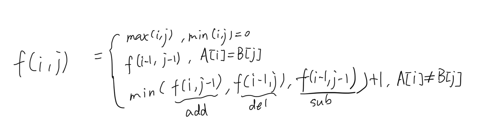

# CS61A

## Welcome&Function 

loop `for` in python, do not forget to add `range ` .

```python
for i in range(a,b): #a included, b excluded (actually [a,b+1])
```

reverse string:

```python
[::-1]
```


## Control&Higher order function

to check a function's docstring:

```python
help(func)
```

and type q to exit.

 lambda expression:

```python
[expression name]=lambda [parameters]:[value] 
```

In python, functions can also be parameters of other functions.


### Hog

Rules: Dice game.

On each turn, the current player chooses some number of dice to roll together, up to 10. That player's score for the turn is the sum of the dice outcomes. However, a player who rolls too many dice risks:

- **Sow Sad**. 
- **Boar Brawl**.
- **Sus Fuss**.

example of `assert` checkers:

```python
    assert type(num_rolls) == int, 'num_rolls must be an integer.'
    assert num_rolls > 0, 'Must roll at least once.'
```


*args syntax is used for the function that has arbitrary numbers of args.

Ex: in problem 8:

```python
def make_averaged(original_function, times_called=1000):
    """Return a function that returns the average value of ORIGINAL_FUNCTION
    called TIMES_CALLED times.

    To implement this function, you will have to use *args syntax.

    >>> dice = make_test_dice(4, 2, 5, 1)
    >>> averaged_dice = make_averaged(roll_dice, 40)
    >>> averaged_dice(1, dice)  # The avg of 10 4's, 10 2's, 10 5's, and 10 1's
    3.0
    """
    # BEGIN PROBLEM 8
   
    def func(*args):
        sum = 0

        for i in range(times_called):
            sum += original_function(*args)
        
        return sum/times_called
    
    return func
```

 We don't precisely know how many parameters the `original_function` needs, so we use `*args`.

## Environment 
The expression is calculated from left to right. If the logical value of the left side of or is true, all expressions after or (whether it is followed by and or, etc.) are short-circuited, and the expression on the left side of or is directly output; if the logical value of the expression on the left side of or is false, the expression after or is output, regardless of whether the following expression is true or false.
The expression is calculated from left to right. If the logical value of the left side of and is false, all expressions after and are short-circuited until or appears, and the expression on the left side of and is output to the left side of or to participate in the next logical operation.
If the left side of or is false, or the left side of and is true, short-circuit logic cannot be used.

The types that can be considered False are: None, 0 of any numeric type, empty string ' ', empty tuple (), empty list [], empty dictionary {}

## Recursion
The source code of hw03 shows a way to check or ban specific key words/structures:
```python
    >>> from construct_check import check
    >>> # ban all assignment statements
    >>> check(HW_SOURCE_FILE, 'num_eights',
    ...       ['Assign', 'AnnAssign', 'AugAssign', 'NamedExpr', 'For', 'While'])
    True
```

### cats

decorator in python (`@`):
Q: What is a decorator in Python?
Choose the number of the correct choice:
0) A way to loop through an iterable
1) A type of design pattern
2) A method for declaring class properties
3) A function that takes another function as an input and returns a new function that extends or modifies the behavior of the original function
? 3

Ex:
```python
'''
>>> def my_decorator(func):
...   def wrapper():
...       print("Say Hello")
...       func()
...       print("Say Goodbye")
...   return wrapper
>>> @my_decorator
... def say_hello():
...     print("Hello World")
>>> say_hello()
(line 1)? Say Hello
(line 2)? Hello World
(line 3)? Say Goodbye
'''

'''
>>> def magic_decorator(func):
...   def wrapper(x):
...     return func(x * 2)
...   return wrapper
>>> @magic_decorator
... def myfunc(x):
...   return x * 3
>>> print(myfunc(4))
? 24
'''
```

to check whether a function is recursive:
```python
'''
>>> from cats import furry_fixes, autocorrect
>>> import tests.construct_check as test
>>> # Check that the recursion stops when the limit is reached
>>> import trace, io
>>> from contextlib import redirect_stdout
>>> with io.StringIO() as buf, redirect_stdout(buf):
...     trace.Trace(trace=True).runfunc(furry_fixes, "someaweqwertyuio", "awesomeasdfghjkl", 3)     
...     output = buf.getvalue()
>>> len([line for line in output.split('\n') if 'funcname' in line]) < 12
'''
```


str slice:

```python
sequence[start:stop:step]
```


question 07: Levenshtein distance

https://zhuanlan.zhihu.com/p/507830576

https://www.youtube.com/watch?v=MiqoA-yF-0M

The dp relation:


```python
def minimum_mewtations(typed, source, limit):
    """A diff function for autocorrect that computes the edit distance from TYPED to SOURCE.
    This function takes in a string TYPED, a string SOURCE, and a number LIMIT.

    Arguments:
        typed: a starting word
        source: a string representing a desired goal word
        limit: a number representing an upper bound on the number of edits

    >>> big_limit = 10
    >>> minimum_mewtations("cats", "scat", big_limit)       # cats -> scats -> scat
    2
    >>> minimum_mewtations("purng", "purring", big_limit)   # purng -> purrng -> purring
    2
    >>> minimum_mewtations("ckiteus", "kittens", big_limit) # ckiteus -> kiteus -> kitteus -> kittens
    3
    """
    if limit < 0:
        return 1
    if typed == "":
        return len(source)
    if source == "":
        return len(typed)
    
    if typed[len(typed)-1] == source[len(source)-1]:
        return minimum_mewtations(typed[:-1], source[:-1], limit )
    else:
        return 1 + min(minimum_mewtations(typed[:-1], source[:-1], limit - 1), minimum_mewtations(typed[:-1], source, limit - 1), minimum_mewtations(typed, source[:-1], limit - 1))
```


## Sequence/List&Data Abstract (Tree)

To show a dictionary's keys and values:
```python
dic.keys()
dic.value()
```

To check a variable's type:`isinstance(<varname>, <vartype>)` or `type(<varname>) == <vartype>`

tree:
```python
def tree(label, branches=[]):
    """Construct a tree with the given label value and a list of branches."""
    for branch in branches:
        assert is_tree(branch), 'branches must be trees'
    return [label] + list(branches)
```

## Iterator,Mutability

use `it = iter(x)` to declare an iterator for an iterable (x)
use `next(it)` to iterate

generator and yield statement:
```python
>>> def letters_generator():
        current = 'a'
        while current <= 'd':
            yield current
            current = chr(ord(current)+1)
>>> for letter in letters_generator():
        print(letter)

a
b
c
d

>>> letters = letters_generator()
>>> type(letters)
<class 'generator'>
>>> letters.__next__()
'a'
>>> letters.__next__()
'b'
>>> letters.__next__()
'c'
>>> letters.__next__()
'd'
```

The first time __next__ is called, the program executes statements from the body of the letters_generator function until it encounters the yield statement. Then, it pauses and returns the value of current. yield statements do not destroy the newly created environment, they preserve it for later. When __next__ is called again, execution resumes where it left off. The values of current and of any other bound names in the scope of letters_generator are preserved across subsequent calls to __next__.

The map function, for example, takes a function and an iterable. It returns an iterator over the result of applying the function argument to each element in the iterable argument.

```python
>>> caps = map(lambda x: x.upper(), b_to_k)
>>> next(caps)
'B'
>>> next(caps)
'C'
```

zip:
```python
>>> [x + y for x, y in zip([1, 2, 3], [4, 5, 6])]
>>> [5, 7, 9]
```

yield from in a recursive situation:
```python
def stair_ways(n):
    """
    Yield all the ways to climb a set of n stairs taking
    1 or 2 steps at a time.

    >>> list(stair_ways(0))
    [[]]
    >>> s_w = stair_ways(4)
    >>> sorted([next(s_w) for _ in range(5)])
    [[1, 1, 1, 1], [1, 1, 2], [1, 2, 1], [2, 1, 1], [2, 2]]
    >>> list(s_w) # Ensure you're not yielding extra
    []
    """
    def recursive_stair_way(m, way):
        if m == 0:
            yield way
        elif m > 0:
            for i in (1, 2):
             
              yield from recursive_stair_way(m-i, way+[i])

    return recursive_stair_way(n, [])
```

